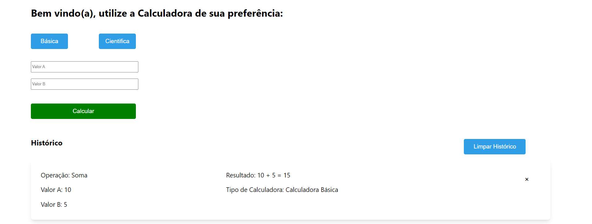

## Available Scripts

In the project directory, you can run:

### `npm install`

### `npm start`

Runs the app in the development mode.\
Open [http://localhost:3000](http://localhost:3000) to view it in your browser.

Aplicação desenvolvida em React com conceitos de utilização de classe como métodos para as calculadoras.

Além disso é utilizado o conceito de UseState para mostrar o histórico de operações realizadas dentre outras funcionalidades.

Pagina inicial:

Opções que aparecem quando clicado em calculadora Básica:

Opções que aparecem quando clicado em calculadora Científica:

Você consegue utilizar a aplicação aqui: https://reactjs-calculadora.herokuapp.com/
